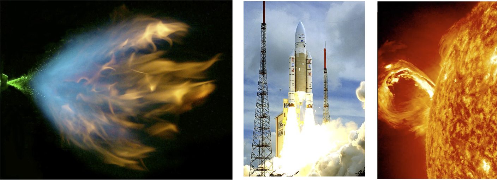

# Méthodes numeriques avancées et calcul haute performance pour la simulation de phénomènes complexes

Dans un nombre croissant d’applications, qu’elles soient scientifiques ou industrielles, la simulation numérique joue un rôle clef pour d’une part comprendre et analyser les phénomènes physiques complexes ou prédire le fonctionnement de dispositifs comme les chambres de combustion aéronautiques dans l’optique d’une conception avancée. La complexité des systèmes et la taille des simulations multi-dimensionnelles rend l’utilisation du calcul haute performance nécessaire. Ce cours propose dans un premier temps une présentation des enjeux que pose la modélisation des systèmes complexe pour les méthodes numériques et la simulation ainsi qu’un état de l’art des nouvelles architectures de calcul. Après avoir rappelé les bases de l’analyse numérique des équations aux dérivées parteilles pour les problèmes multi-échelles, nous proposons d’explorer quelques méthodes numériques avancées conçues pour traiter la raideur présente dans ces modèles complexes tout en tirant le meilleur parti des nouvelles architectures de calcul par une combinaison efficace entre analyse numérique, modélisation mathématiques et calcul scientifique. Les séances de travaux pratiques se font au moyen de "notebooks" Jupyter, ce qui permet une familiarisation avec les concepts et les méthodes numériques présentées en cours.

Contenu du cours :
* Modélisation mathématique des systèmes complexes
* Définition de la notion de calcul haute performance et synthèse sur les nouvelles architectures de calcul
* Analyse numérique des équations aux dérivées partielles multi-échelles
* Présentation et analyse de méthodes numériques avancées conçues pour le calcul haute performance (multi-résolution adaptative et séparation d’opérateur avec adaptation temps/espace, algorithme pararéel, méthodes préservant l’asymptotique,...)
* Travaux pratiques avec des "notebooks" Jupyter
